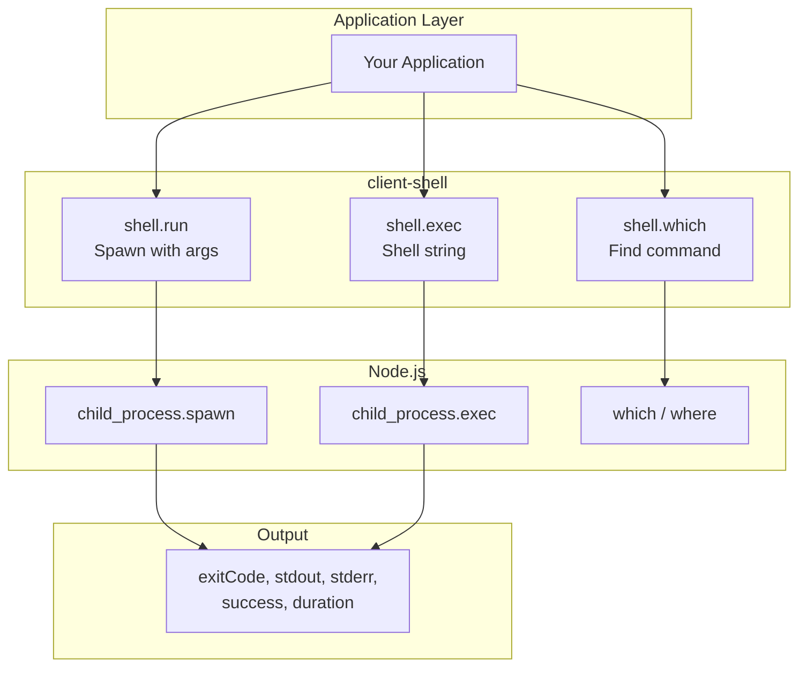
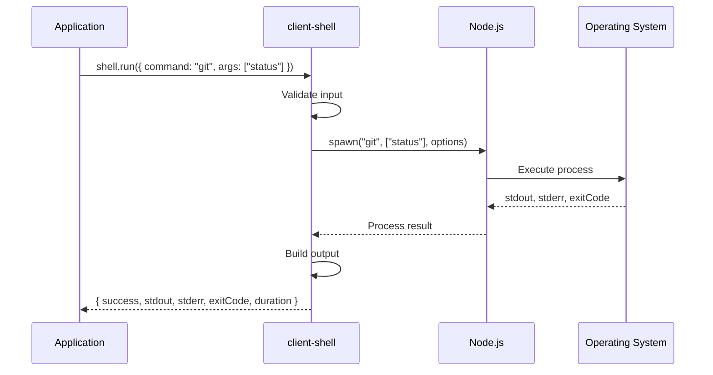
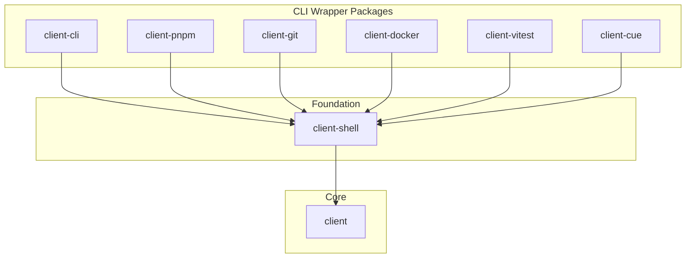
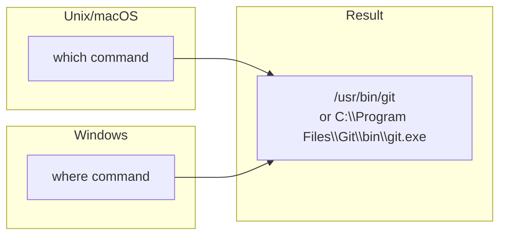
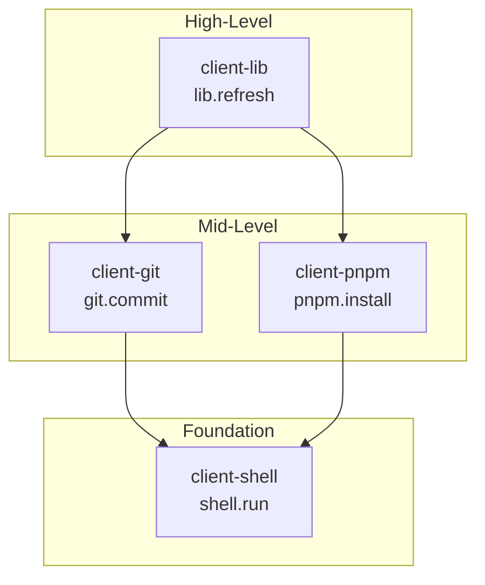

# @mark1russell7/client-shell

[](https://opensource.org/licenses/MIT)
[](https://www.typescriptlang.org/)
[](https://nodejs.org/)

> Generic shell command execution procedures - the foundation layer for all CLI wrapper packages in the Mark ecosystem.

## Table of Contents

- [Overview](#overview)
- [Installation](#installation)
- [Architecture](#architecture)
- [Quick Start](#quick-start)
- [API Reference](#api-reference)
  - [shell.run](#shellrun)
  - [shell.exec](#shellexec)
  - [shell.which](#shellwhich)
- [Use Cases](#use-cases)
- [Cross-Platform Notes](#cross-platform-notes)
- [Integration](#integration)
- [Requirements](#requirements)
- [License](#license)

---

## Overview

**client-shell** provides low-level shell command execution as RPC procedures:

- **shell.run** - Spawn processes with arguments (no shell interpretation, safer)
- **shell.exec** - Execute command strings via shell (supports pipes, redirects)
- **shell.which** - Find command paths cross-platform

This package is the **foundation** for all CLI wrapper packages.

---

## Installation

```bash
npm install github:mark1russell7/client-shell#main
```

---

## Architecture

### System Overview



### Command Execution Flow



### Dependency Tree



---

## Quick Start

```typescript
import { Client } from "@mark1russell7/client";
import "@mark1russell7/client-shell/register"; // Auto-registers procedures

const client = new Client({ /* transport */ });

// Run a command with arguments
const result = await client.call(["shell", "run"], {
  command: "git",
  args: ["status", "--short"],
  cwd: "/path/to/repo",
});

console.log(result.stdout);
// M  src/index.ts
// ?? new-file.ts
```

---

## API Reference

### Procedures Summary

| Path | Description |
|------|-------------|
| `shell.run` | Spawn process with arguments (no shell) |
| `shell.exec` | Execute command string through shell |
| `shell.which` | Find full path to a command |

---

### shell.run

Spawn a process directly without shell interpretation. **Safer for untrusted input.**

```typescript
interface ShellRunInput {
  command: string;              // Command to run
  args?: string[];              // Arguments (default: [])
  cwd?: string;                 // Working directory
  env?: Record<string, string>; // Environment variables
  timeout?: number;             // Timeout in ms
  encoding?: string;            // Output encoding (default: "utf8")
}

interface ShellRunOutput {
  exitCode: number;
  stdout: string;
  stderr: string;
  success: boolean;  // true if exitCode === 0
  duration: number;  // ms
}
```

**Example:**
```typescript
await client.call(["shell", "run"], {
  command: "npm",
  args: ["install", "--save-dev", "typescript"],
  cwd: "/my/project",
  timeout: 60000,
});
```

---

### shell.exec

Execute a command string through the system shell. Supports pipes, redirects, etc.

```typescript
interface ShellExecInput {
  command: string;              // Full command string
  cwd?: string;                 // Working directory
  env?: Record<string, string>; // Environment variables
  timeout?: number;             // Timeout in ms
  shell?: boolean | string;     // Shell to use (default: true)
  maxBuffer?: number;           // Max stdout/stderr buffer
  stdin?: string;               // Input to pipe to stdin
}

interface ShellExecOutput {
  exitCode: number;
  stdout: string;
  stderr: string;
  success: boolean;
  duration: number;
  signal?: string;  // Signal that terminated process
}
```

**Example:**
```typescript
await client.call(["shell", "exec"], {
  command: "git log --oneline | head -5",
  cwd: "/my/repo",
});
```

---

### shell.which

Find the full path to a command. Uses `where` on Windows, `which` on Unix.

```typescript
interface ShellWhichInput {
  command: string;  // Command to find
}

interface ShellWhichOutput {
  path: string | null;  // Full path or null if not found
  found: boolean;
}
```

**Example:**
```typescript
const { path, found } = await client.call(["shell", "which"], {
  command: "node",
});
// { path: "/usr/local/bin/node", found: true }
```

---

## Use Cases

### Building CLI Wrappers

The `shell.run` procedure is the foundation for CLI wrapper packages:

```typescript
// In client-git/src/procedures/git/status.ts
export async function gitStatus(input: GitStatusInput, ctx: ProcedureContext) {
  const args = ["status"];
  if (input.short) args.push("--short");

  const result = await ctx.client.call(["shell", "run"], {
    command: "git",
    args,
    cwd: input.cwd,
  });

  return parseGitStatus(result.stdout);
}
```

### Checking Command Availability

```typescript
async function ensureGitAvailable() {
  const { found } = await client.call(["shell", "which"], { command: "git" });
  if (!found) {
    throw new Error("Git is not installed or not in PATH");
  }
}
```

### Piping Commands

```typescript
// Using shell.exec for pipes
const result = await client.call(["shell", "exec"], {
  command: "cat package.json | jq '.dependencies'",
  cwd: "/my/project",
});
```

---

## Cross-Platform Notes

### shell.which Behavior



### shell.run vs shell.exec

| Feature | shell.run | shell.exec |
|---------|-----------|------------|
| Shell interpretation | No | Yes |
| Pipes & redirects | No | Yes |
| Argument safety | Safer | Less safe |
| Use case | Known commands | Shell scripts |
| Platform quoting | Handled | Manual |

---

## Integration

### With Other Packages



### With MCP (Claude)

When using the MCP server with bundle-dev, Claude has access to shell.* procedures:

```
User: "Run npm install in /my/project"
Claude: [Uses shell.run with command: "npm", args: ["install"]]
```

---

## Requirements

- **Node.js** >= 20
- **Dependencies:**
  - `@mark1russell7/client` (peer dependency)
  - `zod` ^3.24.0

---

## License

MIT
